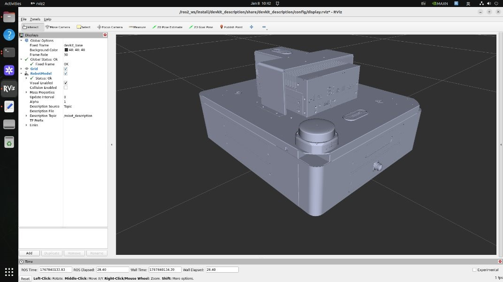
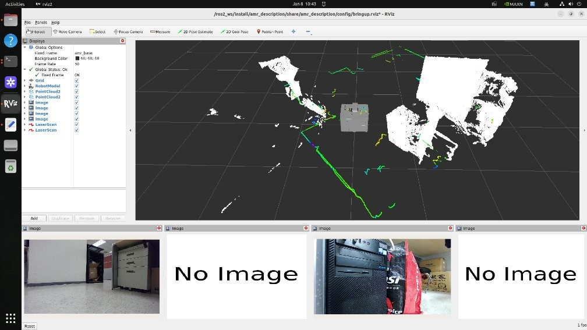

# Advantech AMR DevKit

The Advantech AMR DevKit is a professional hardware-integration toolkit designed to provide a stable foundation for autonomous mobile robots. It focuses on the seamless connection between the Advantech MIC-732-AO (featured with NVIDIA® Jetson AGX Orin™) and essential robotic sensors, including GMSL depth cameras, 2D LiDARs, and fisheye vision systems.

This kit simplifies the complex process of hardware setup by providing pre-configured drivers and accurate 3D models (URDF). It ensures that the robot has a solid foundation, allowing developers to focus on high-level application development rather than low-level sensor troubleshooting.

## Key Features

- **Seamless MIC-732-AO Integration**: Specifically tuned for Advantech’s industrial edge AI computer, ensuring stable data transmission from GMSL and USB interfaces.

- **Flexible Camera Support**: Pre-integrated support for Gemini 335L GMSL depth cameras for spatial sensing and SHF3L fisheye cameras for wide-angle visual coverage.

- **Ready-to-Use 3D Models**: Includes high-fidelity URDF and Xacro files that represent the physical system accurately in ROS 2, providing a perfect "Digital Twin" for simulation and monitoring.

- **Rapid Initialization**: Designed for an "easy-to-setup" experience. With a single configuration file and a few commands, the entire sensor suite and coordinate system (TF Tree) are ready for operation.

- **Extensible AI Demo Scenario**: Supports the optional AMR Perceptor as a Git submodule, which adds AI-driven object detection and natural language interaction to the core hardware platform.

## System Architecture

The DevKit architecture is designed to be the robust base layer of a robotic stack:

1. **Hardware Interface Layer**: Manages the physical connections to GMSL cameras, RPLidar, and fisheye sensors. It ensures the MIC-732-AO correctly recognizes and powers all peripherals.

2. **Driver & Communication Layer**: Launches the ROS 2 drivers that transform raw hardware signals into standardized sensor topics (e.g., `/scan` for LiDAR, `/image_raw` for cameras).

3. **Spatial Transformation Layer (TF Tree)**: Uses the URDF model to establish the physical relationship between different sensors. This layer tells the robot exactly where each camera is mounted, which is essential for accurate navigation and 3D perception.

4. **Perception Layer (Optional Submodule)**: While the DevKit provides high-quality raw data, the optional Perceptor submodule handles tasks like image resizing, point cloud downsampling, and AI-based object detection.

## Installation Guide

### 1. Install Dependencies

```bash
sudo apt update
sudo apt install -y ros-$ROS_DISTRO-rmw-fastrtps-cpp ros-$ROS_DISTRO-rmw-cyclonedds-cpp ros-$ROS_DISTRO-rosbridge-server
sudo apt install -y libgflags-dev nlohmann-json3-dev \
    ros-$ROS_DISTRO-image-transport ros-${ROS_DISTRO}-image-transport-plugins ros-${ROS_DISTRO}-compressed-image-transport \
    ros-$ROS_DISTRO-image-publisher ros-$ROS_DISTRO-camera-info-manager \
    ros-$ROS_DISTRO-diagnostic-updater ros-$ROS_DISTRO-diagnostic-msgs ros-$ROS_DISTRO-statistics-msgs ros-$ROS_DISTRO-xacro \
    ros-$ROS_DISTRO-backward-ros libdw-dev libssl-dev mesa-utils libgl1

```

### 2. Compile the Workspace

```bash
ROS_WORKSPACE=~/ros2_ws
mkdir -p $ROS_WORKSPACE/src && cd $ROS_WORKSPACE/src
git clone --recursive https://github.com/advantech-EdgeAI/AMR_DevKit.git

cd $ROS_WORKSPACE
colcon build --cmake-args -DCMAKE_EXE_LINKER_FLAGS="-lcurl"

source $ROS_WORKSPACE/install/setup.bash
echo "source $ROS_WORKSPACE/install/setup.bash" >> ~/.bashrc
```

### 3. Check the Result

The ROS 2 package list should include the following three packages.

```bash
$ ros2 pkg list | grep description

amr_description
devkit_description
orbbec_description
```

## Usage / Quick Start

### 1. Understanding the Operation Modes

The DevKit provides two configurations to match how you use the system:

- **DevKit Mode (devkit_description)**: Designed for users who want to modify or customize the robot. It is an "open" configuration that allows you to change sensor types and positions.

- **AMR Mode (amr_description)**: A preset, "factory default" configuration for the standard Advantech AMR. This mode is pre-calibrated and should not be changed by the user.

### 2. Display Mode (Visualization & Verification)

Verify the robot's physical model and coordinate system in RViz without physical hardware connected.

```bash
# For a customizable DevKit setup
ros2 launch devkit_description display.launch.py display_rviz:=true

# For the preset Standard AMR
ros2 launch amr_description display.launch.py display_rviz:=true
```



### 3. Bringup Mode (Live Hardware Operation)

Start the physical sensors and the live coordinate system for real-world operation.

```bash
# For a customizable DevKit setup
ros2 launch devkit_description bringup.launch.py bringup_rviz:=true

# For the preset Standard AMR
ros2 launch amr_description bringup.launch.py bringup_rviz:=true
```



⚠️ **Important Notice**

To prevent system crashes or coredump errors on the MIC-732-AO, please manually close the RViz viewer window before pressing `Ctrl+C` in the terminal to terminate the launch process.

### 4. Customizing Sensor Layout (DevKit Mode Only)

In the DevKit configuration, you can easily change which sensors are used and where they are mounted to fit your specific needs.

- Configuration File: `rospkg/devkit_description/config/sensors.yaml`
- How to update:
    1. Open the `sensors.yaml` file.
    2. Modify the sensor types (options: `"none"`, `"plain"`, `"Gemini335L"`, `"SHF3L"`) and their connection ports.
    3. Save the file and re-build the package:

        ```bash
        cd ~/ros2_ws
        colcon build --packages-select devkit_description
        source install/setup.bash
        ```

Note: This feature is only available for the `devkit_description` package.

### 5. Optional: AI Perceptor Demo Scenario

Follow the instructions in the [Advantech AMR Perceptor](https://github.com/advantech-EdgeAI/AMR_Perceptor) README to complete the settings.